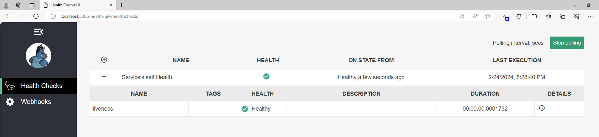
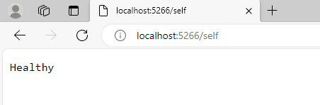

# Health Checks in Common.HealthChecks

## Overview

Health checks are vital for maintaining the reliability and efficiency of web services. They offer real-time insights into the health and performance of various system components.

### Benefits of Health Checks

- **Real-Time Monitoring**: Health checks provide immediate information about the operational status of services.
- **Proactive Issue Identification**: They help in detecting issues before they affect users.
- **Service Availability Assurance**: Ensure that services are available and responding as expected.

### Integration with Kubernetes

- **Liveness Probes**: Kubernetes can utilize liveness health checks to understand whether an application is running and healthy. It can restart the service if the liveness probe fails.

### Usage for Better Monitoring

- Implementing health checks allows for efficient monitoring of system components, thereby facilitating quick responses to any identified issues.

## Health Check Endpoints and Configuration

### Endpoints

1. **/self**: Endpoint for the service's self-health.
2. **/health**: General health endpoint, it has the format needed for the UI.
3. **/health-ui**: UI for health checks.
4. **/health-ui-api**: Endpoint for health check data (it aggregates the healths for the UI).

### Configuration in Code

The `HealthCheckExtensions` class configures and adds custom health checks to the services:

- **AddCustomHealthChecks**: Registers health checks and health check UI.
- **UseCustomHealthChecks**: Configures middleware for health check endpoints.

### Options

`HealthCheckUIOptions` class provides configuration options:

- **EvaluationTimeInSeconds**: Time interval for health check evaluation.
- **MaximumHistoryEntriesPerEndpoint**: Maximum stored history records per endpoint.
- **ApiMaxActiveRequests**: Max concurrent requests to the health check API.
- **MinimumSecondsBetweenFailureNotifications**: Minimum time between failure notifications.
